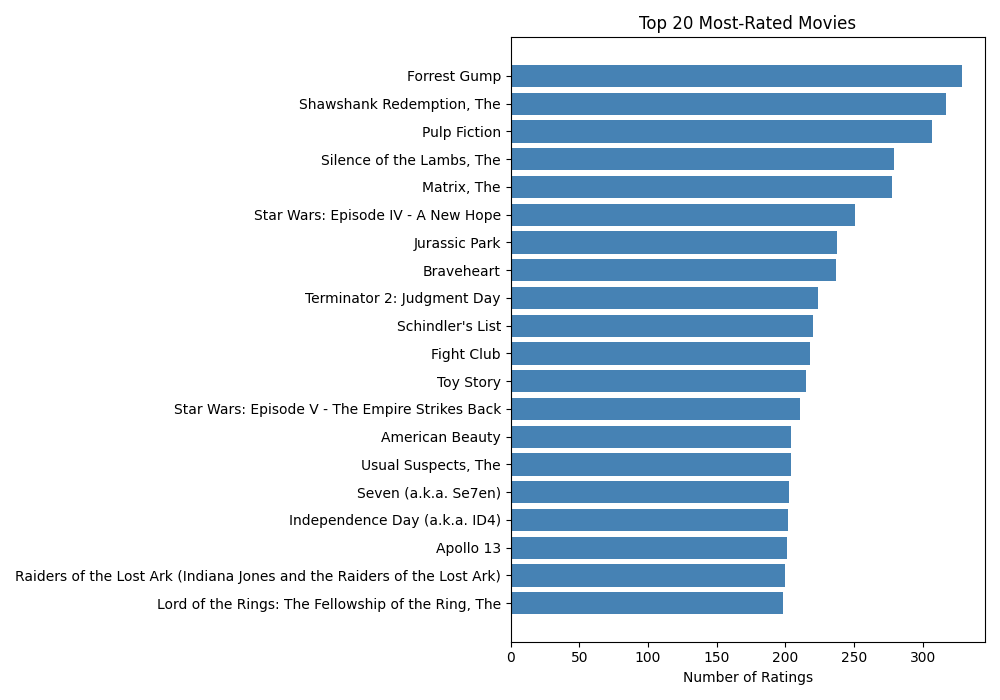
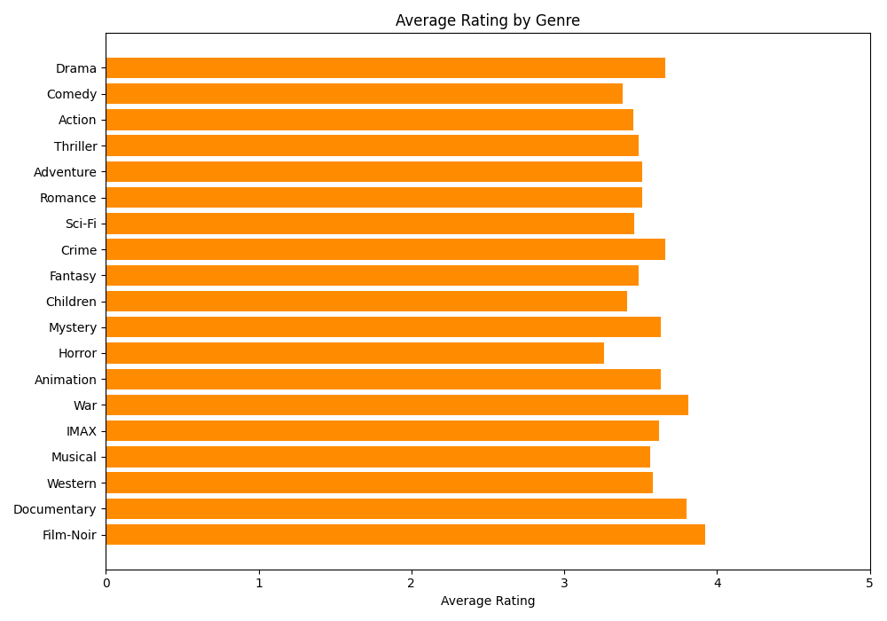
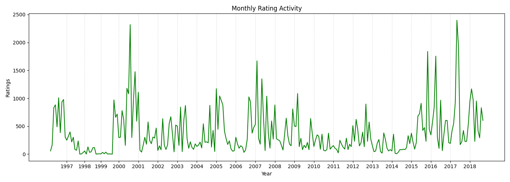

# MovieLens Lakehouse

A end-to-end data engineering project built with PySpark, Delta Lake, dbt, BigQuery, Terraform, Metabase, Docker, and pytest.

I built this project to demonstrate the full lifecycle of a modern data platform: ingest raw data, clean and model it into trusted tables, publish business-ready KPIs, validate correctness, deploy cloud infrastructure with code, and serve insights through a BI tool.

The dataset is MovieLens Small (100k+ movie ratings), used as a product analytics case study: top content, genre performance, rating trends, and user activity.


---

## What This Project Demonstrates

- Building a **medallion architecture** (Bronze / Silver / Gold) with PySpark and Delta Lake
- Replicating the same transformation logic in **SQL with dbt** targeting BigQuery
- Provisioning cloud infrastructure (**BigQuery datasets + service accounts**) with Terraform
- Loading raw data to the cloud and serving Gold tables through a **Metabase BI dashboard**
- Separating reusable transformation logic into `src/transformations.py`
- Writing **unit tests** (pytest) and **dbt schema tests** for data quality
- Running an **end-to-end validation** script that checks the produced Delta tables
- Packaging the full environment with **Docker Compose** (JupyterLab + Metabase)

---

## Architecture

```
Raw CSV files
  │
  ├─► PySpark pipeline (local)
  │     Bronze Delta tables  (raw landing zone)
  │       └─► Silver Delta tables  (clean, typed, deduplicated)
  │               └─► Gold Delta tables + PNG charts  (KPIs)
  │
  └─► Cloud pipeline
        BigQuery: movielens_raw  (loaded by scripts/load_to_bigquery.py)
          └─► dbt: movielens_dbt  (staging views + mart tables)
                └─► Metabase dashboard  (BI on Gold tables)

Infrastructure provisioned by Terraform:
  - BigQuery datasets (raw, dbt dev, dbt prod)
  - Service accounts with least-privilege IAM roles
```

---

## Stack

| Layer | Tool | Purpose |
|---|---|---|
| Compute | **PySpark 4.1** | In-memory data processing |
| Storage | **Delta Lake 4.2** | ACID transactions on local files |
| Cloud DW | **BigQuery** | Serverless SQL analytics |
| Transforms | **dbt** | SQL models + schema tests in BigQuery |
| IaC | **Terraform** | Reproducible GCP infrastructure |
| BI | **Metabase** | No-code dashboards on Gold tables |
| Orchestration | **Docker Compose** | JupyterLab + Metabase in one command |
| Testing | **pytest + dbt test** | Unit tests + data quality tests |

---

## Medallion Layers

| Layer | Purpose | Examples |
|---|---|---|
| Bronze | Raw landing zone with ingestion timestamp | `bronze/ratings`, `bronze/movies`, `bronze/tags` |
| Silver | Clean, typed, deduplicated, enriched data | `silver/ratings`, `silver/movies`, `silver/ratings_enriched` |
| Gold | Business-ready KPI tables | `gold/top_movies`, `gold/genre_performance`, `gold/ratings_over_time`, `gold/user_activity` |

---

## Pipeline Steps

### Local (PySpark + Delta Lake)

| Step | File | What it does |
|---|---|---|
| 1 | `notebooks/01_bronze.py` | Reads raw CSV files, adds `ingested_at`, writes Delta tables |
| 2 | `notebooks/02_silver.py` | Casts types, filters invalid ratings, deduplicates, extracts release years, explodes genres |
| 3 | `notebooks/03_gold.py` | Builds KPI tables and saves PNG charts |
| 4 | `notebooks/04_validate.py` | Checks row counts, data quality rules, and chart files |

### Cloud (BigQuery + dbt)

| Step | Tool | What it does |
|---|---|---|
| 1 | `terraform apply` | Creates BigQuery datasets and service accounts in GCP |
| 2 | `scripts/load_to_bigquery.py` | Uploads raw CSVs to `movielens_raw` dataset |
| 3 | `dbt run` | Builds staging views and Gold mart tables in `movielens_dbt` |
| 4 | `dbt test` | Runs schema tests (not_null, unique, accepted_values) |
| 5 | Metabase at `:3000` | Connect to BigQuery and explore Gold tables as dashboards |

---

## dbt Models

```
dbt/models/
├── sources.yml                    # points to movielens_raw tables in BigQuery
├── schema.yml                     # dbt tests for all models
├── staging/                       # materialized as views
│   ├── stg_ratings.sql            # cast types, filter 0.5–5.0, deduplicate
│   ├── stg_movies.sql             # extract release_year from title
│   └── stg_tags.sql               # remove nulls and empty tags
└── marts/                         # materialized as tables
    ├── silver_ratings_enriched.sql # ratings joined with movie metadata
    ├── gold_top_movies.sql         # top 20 most-rated movies (min 10 ratings)
    ├── gold_genre_performance.sql  # avg rating + volume per genre
    ├── gold_ratings_over_time.sql  # monthly activity
    └── gold_user_activity.sql      # users segmented by activity level
```

---

## Terraform Infrastructure

`terraform/main.tf` provisions:

- **3 BigQuery datasets**: `movielens_raw`, `movielens_dbt`, `movielens_dbt_prod`
- **Service account `movielens-dbt`**: read access on raw, write access on dbt datasets
- **Service account `movielens-loader`**: write access on raw dataset only
- **Key files** written to `secrets/` (git-ignored)

---

## Gold KPIs

| Table | Description |
|---|---|
| `gold/top_movies` | Top 20 most-rated movies with average rating |
| `gold/genre_performance` | Average rating and total ratings per genre |
| `gold/ratings_over_time` | Monthly rating activity for trend analysis |
| `gold/user_activity` | Users segmented by rating volume (casual / active / power_user) |

---

## Sample Outputs

### Top 20 Most-Rated Movies



### Average Rating by Genre



### Monthly Rating Activity



---

## Testing & Validation

### Unit tests (pytest)

Tests in `tests/test_transformations.py` verify the core transformation rules:

- Ratings are cast to correct types
- Invalid ratings are filtered out
- Movie release years are extracted from titles
- Genre strings are split into one row per genre
- Top-movie logic respects the minimum rating threshold

```bash
python -m pytest tests/ -v
```

### End-to-end validation (PySpark pipeline)

`notebooks/04_validate.py` reads the produced Delta tables and confirms:

- Bronze and Silver tables are populated
- Silver row count does not exceed Bronze (dedup must reduce rows)
- No null IDs, null ratings, or out-of-range ratings in Silver
- Silver ratings are deduplicated by `userId` and `movieId`
- Gold KPI tables are populated
- Top movies respect the minimum rating threshold
- Chart files exist and are non-empty

```bash
python3 work/notebooks/04_validate.py
```

### dbt schema tests

`dbt/models/schema.yml` defines automatic tests on every model:

```bash
dbt test
```

Checks include `not_null`, `unique`, and `accepted_values` — for example, `rating` must be one of `[0.5, 1.0, ..., 5.0]` and `user_segment` must be one of `[casual, active, power_user]`.

---

## How To Run

### Prerequisites

- Docker Desktop installed and running
- GCP account with a project (for the cloud pipeline)
- Terraform >= 1.5 and `gcloud` CLI (for cloud pipeline only)

---

### Local pipeline (PySpark + Delta Lake)

#### 1. Clone and download data

```bash
git clone https://github.com/fatemesbati/Movie-Analytics-Lakehouse-on-Databricks.git
cd movielens-lakehouse
python data/download_data.py
```

#### 2. Start JupyterLab + Metabase

```bash
docker compose up --build
```

| Service | URL |
|---|---|
| JupyterLab | http://localhost:8080 |
| Metabase | http://localhost:3000 |

#### 3. Run the pipeline inside the JupyterLab terminal

```bash
python3 work/notebooks/01_bronze.py
python3 work/notebooks/02_silver.py
python3 work/notebooks/03_gold.py
python3 work/notebooks/04_validate.py
```

---

### Cloud pipeline (BigQuery + dbt + Terraform)

#### 1. Provision GCP infrastructure

```bash
cd terraform
cp terraform.tfvars.example terraform.tfvars
# Edit terraform.tfvars: set your GCP project_id
terraform init
terraform apply
```

This creates the BigQuery datasets and writes service account keys to `secrets/`.

#### 2. Load raw data to BigQuery

```bash
export GCP_PROJECT_ID=your-project-id
export GOOGLE_APPLICATION_CREDENTIALS=secrets/loader-service-account.json
python scripts/load_to_bigquery.py
```

#### 3. Run dbt

```bash
cd dbt
export GOOGLE_APPLICATION_CREDENTIALS=../secrets/dbt-service-account.json
dbt deps        # install dbt_utils
dbt run         # build all models in BigQuery
dbt test        # run schema tests
```

#### 4. Connect Metabase to BigQuery

1. Open http://localhost:3000
2. Add a BigQuery database connection using the dbt service account key
3. Browse `movielens_dbt` — the Gold tables are ready to chart

---

## Project Structure

```
movielens-lakehouse/
├── data/
│   └── download_data.py
├── notebooks/
│   ├── 01_bronze.py
│   ├── 02_silver.py
│   ├── 03_gold.py
│   └── 04_validate.py
├── src/
│   └── transformations.py
├── tests/
│   └── test_transformations.py
├── dbt/
│   ├── dbt_project.yml
│   ├── profiles.yml
│   ├── packages.yml
│   └── models/
│       ├── sources.yml
│       ├── schema.yml
│       ├── staging/
│       │   ├── stg_ratings.sql
│       │   ├── stg_movies.sql
│       │   └── stg_tags.sql
│       └── marts/
│           ├── silver_ratings_enriched.sql
│           ├── gold_top_movies.sql
│           ├── gold_genre_performance.sql
│           ├── gold_ratings_over_time.sql
│           └── gold_user_activity.sql
├── terraform/
│   ├── provider.tf
│   ├── variables.tf
│   ├── main.tf
│   ├── outputs.tf
│   └── terraform.tfvars.example
├── scripts/
│   └── load_to_bigquery.py
├── charts/
├── secrets/               # git-ignored, created by terraform apply
├── docker-compose.yml
├── requirements.txt
└── README.md
```

---

## Dataset

[MovieLens Small](https://grouplens.org/datasets/movielens/latest/) — F. Maxwell Harper and Joseph A. Konstan. 2015. The MovieLens Datasets: History and Context. ACM TiiS 5(4):19.
